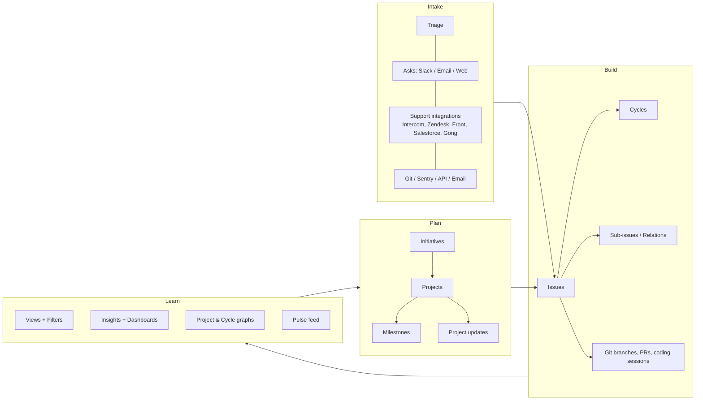

# Product summary

## What Polaris is

A keyboard-first, local-first issue tracker for software teams. Each client holds a replica of the workspace and answers filters, sorts and groupings from it; the server's job is to keep that replica true. Changes apply locally first and sync to the rest of the team in real time.

It covers planning (initiatives → projects → milestones), execution (issues → cycles), intake (triage and inbound requests), delivery (git integrations, releases) and reporting (insights, dashboards, updates). One GraphQL API serves the clients and every integration, with no private API behind it. The core is AGPL and self-hostable; see `06-product-model/01-licensing-and-distribution.md`.

## Category context

Polaris works in an established category of software-team issue trackers, of which Linear is a well-known example. Part of the scope in `01-features/` was researched from public product documentation, Linear's included, and some sections below still describe that documented behaviour as the reference point; `05-source-index.md` records the sources.

## The four loops of the product

## Surfaces (clients)

| Surface | Notes |
|---|---|
| Web app | Chrome/Firefox/Safari, last 3 versions. Offline mode works in browser too. |
| Desktop (macOS Intel, macOS Apple Silicon, Windows) | Native OS notifications, dock/taskbar badge, in-app tabs, fewer shortcut conflicts, auto-update (disable-able via `defaults`/plist on macOS). Probes localhost ports `44450`, `18450`, `33234` to detect whether the desktop app is installed so web links can hand off. `linear://` protocol opens a URL in the desktop app. |
| iOS / Android | Tab bar: Home (My issues, favorites, teams), Inbox (read/snooze/act), Create, Search, Settings. Syncs with other clients. |
| Mobile/tablet PWA | Fallback. |
| No Linux client | Browser only. Explicitly not on the roadmap. |

## Navigation model (sidebar)

Ordered top to bottom, per Linear's own docs nav and app layout:

- **Workspace-level**: Inbox, My Issues, Pulse, Reviews (code), Drafts, Loops, Initiatives, Projects, Views, Dashboards, Customers, Teams
- **Favorites** (appears once you have one; supports folders, drag-and-drop)
- **Your teams** — each expands to: Team home (Overview/Documents/Members), Triage*, Issues (All / Active / Backlog), Cycles*, Projects, Views, Loops. `*` = opt-in per team setting.
- **Exploring** — a temporary section for teams you visit but haven't joined.

Settings is a **mode**, not a section of this list: on a `/settings` path the sidebar is
replaced by a grouped settings navigation (Account, Workspace, Features, Integrations, Data)
with a way back to the app at the top. It is entered from the workspace menu, `G`+`S`, or the
command menu. See `07-milestones/54-settings-mode.md`.

## Global interaction primitives to build

| Primitive | Behaviour |
|---|---|
| Command menu (`Cmd/Ctrl+K`) | Context-aware action + navigation palette. Type `i ` to scope to issues, `p ` projects, `u ` users, `t ` teams, `l ` labels, `f ` favorites, `d ` documents. Peek preview activates as you move through results. |
| Search (`/`) | Full-text across issues, projects, documents (title, description, comments). Exact-ID and shorthand ID matching (`LIN-123`, `lin123`). Quoted terms = exact; stop words stripped otherwise. Max 500 results. Sortable by relevance/updated/created. `@`-mentions inside search build filters. |
| In-view find (`Cmd/Ctrl+F`) | Temporary filter over the current list/board/inbox; matches on title/ID only. |
| Peek (`Space`) | Hover-preview of the focused issue/project without navigating. Tap to pin, hold to preview, `↑/↓` to move, `Esc` to close. |
| Selection (`X`, `Shift+X`, `Shift+click`, `Cmd/Ctrl+A`) | Multi-select then bulk-act via command menu/right-click/bulk toolbar. |
| Contextual menu (right-click) | Everywhere: issues, projects, views, labels, sidebar items, board columns. |
| Undo (`Cmd/Ctrl+Z`) | Applies to destructive and structural actions only: deleting issues — one, or a whole selection, which comes back together — and moving an issue between teams. It is deliberately **not** a general undo and never gains a redo: a field edit is taken back by editing it back, and a description by its version history. The offer lives in a toast for a few seconds and then lapses, because an Undo still on screen a minute later is pressed by somebody who has forgotten what it undoes. |
| Favorites (`Alt+F`, star icon) | Personal sidebar shortcuts for issues, projects, views, documents, initiatives, cycles, labels, teams, customers, dashboards, PRs, releases. Folders supported. |

## Non-obvious product rules worth capturing early

These bite you if you design the schema without them:

- An **issue belongs to exactly one team** and **at most one project** and **at most one cycle** and **at most one project milestone**. Sub-issues may live in a *different* team from their parent.
- Moving an issue between teams mints a **new issue identifier**; old identifiers and URLs must keep resolving forever (redirect + search by old ID).
- **Labels are scoped** to workspace or team; team labels with the same name across teams behave as one label when filtering multi-team views — but *not* via the API, where each has a distinct ID.
- **Duplicate** is both a relation *and* a reserved, system-managed status.
- **Triage** is a status category, not just a view.
- **Estimates** are optional per team; when off, everything that needs a number treats each issue as 1 point.
- **Archiving is automatic only** — there is no manual archive action. Deletion is manual, with a 30-day recovery window.
- Hard limit: **60,000 non-archived issues per team**.
- Inbox retains at most **2,000 open notifications**.
