# Domain model

Entity names follow Linear's GraphQL schema where the docs expose them (`Issue`, `WorkflowState`, `Cycle`, `Project`, `ProjectMilestone`, `Initiative`, `IssueLabel`, `IssueRelation`, `Attachment`, `Customer`, `CustomerNeed`, `Comment`, `Document`, `AuditEntry`, `Webhook`, `EntityExternalLink`, …). Where the schema name isn't documented publicly, the name is marked **[INFERRED]**.

## Core ERD

```mermaid
erDiagram
    ORGANIZATION ||--o{ TEAM : contains
    ORGANIZATION ||--o{ USER : has
    ORGANIZATION ||--o{ INITIATIVE : has
    ORGANIZATION ||--o{ CUSTOMER : has
    ORGANIZATION ||--o{ PROJECT_STATUS : defines
    ORGANIZATION ||--o{ ISSUE_LABEL : "workspace labels"
    ORGANIZATION ||--o{ TEMPLATE : "workspace templates"

    TEAM ||--o{ TEAM : "parent / sub-team (max 5 levels)"
    TEAM ||--o{ ISSUE : owns
    TEAM ||--o{ WORKFLOW_STATE : defines
    TEAM ||--o{ CYCLE : schedules
    TEAM ||--o{ ISSUE_LABEL : "team labels"
    TEAM ||--o{ TEMPLATE : "team templates"
    TEAM ||--o{ DOCUMENT : "team docs"
    TEAM ||--o{ TEAM_MEMBERSHIP : has
    USER ||--o{ TEAM_MEMBERSHIP : joins

    ISSUE ||--o| WORKFLOW_STATE : "status"
    ISSUE ||--o| CYCLE : "in cycle"
    ISSUE ||--o| PROJECT : "in project"
    ISSUE ||--o| PROJECT_MILESTONE : "in milestone"
    ISSUE ||--o| USER : "assignee"
    ISSUE ||--o| APP_USER : "delegate (agent)"
    ISSUE ||--o{ ISSUE : "parent / sub-issue"
    ISSUE ||--o{ ISSUE_RELATION : relates
    ISSUE }o--o{ ISSUE_LABEL : labeled
    ISSUE ||--o{ COMMENT : has
    ISSUE ||--o{ ATTACHMENT : has
    ISSUE ||--o{ CUSTOMER_NEED : "requests"
    ISSUE ||--o{ ISSUE_HISTORY : "activity"
    ISSUE ||--o| SLA : "at most one"
    ISSUE ||--o| RELEASE : "shipped in"

    PROJECT }o--o{ TEAM : "multi-team"
    PROJECT ||--o{ PROJECT_MILESTONE : has
    PROJECT ||--o{ PROJECT_UPDATE : has
    PROJECT ||--o{ DOCUMENT : has
    PROJECT ||--o{ ENTITY_EXTERNAL_LINK : resources
    PROJECT }o--o{ PROJECT_LABEL : labeled
    PROJECT ||--o| PROJECT_STATUS : "status"
    PROJECT ||--o| USER : "lead"
    PROJECT ||--o{ PROJECT_DEPENDENCY : "blocks / blocked by"
    PROJECT ||--o{ CUSTOMER_NEED : "requests"

    INITIATIVE ||--o{ INITIATIVE : "parent / sub (max 5 levels, multi-parent)"
    INITIATIVE }o--o{ PROJECT : contains
    INITIATIVE ||--o{ INITIATIVE_UPDATE : has
    INITIATIVE }o--o{ INITIATIVE_LABEL : labeled
    INITIATIVE ||--o| USER : "owner"
    INITIATIVE ||--o| TEAM : "lead team"

    CUSTOMER ||--o{ CUSTOMER_NEED : raises
    CUSTOMER ||--o| CUSTOMER_TIER : tier
    CUSTOMER ||--o| CUSTOMER_STATUS : status
    CUSTOMER_NEED ||--o| ATTACHMENT : "source link"

    COMMENT ||--o{ COMMENT : "threaded reply"
    COMMENT ||--o{ REACTION : has
    DOCUMENT ||--o{ DOCUMENT_VERSION : history

    VIEW ||--o{ INSIGHT : renders
    DASHBOARD ||--o{ INSIGHT : embeds

    RELEASE_PIPELINE ||--o{ RELEASE : contains
    RELEASE ||--o{ RELEASE_NOTE : has

    LOOP ||--o{ LOOP_RUN : executes
    AGENT_SESSION ||--o{ AGENT_ACTIVITY : emits
```

## Entity reference

### Organization / Workspace
The top container. One per company (Linear explicitly recommends a single workspace). Unique URL slug `linear.app/<workspace>`. Owns: teams, users, initiatives, customers, project statuses, workspace labels/templates, integrations, security config, billing, AI credit balance.

Key fields: name, URL key, logo, **data region** (US or EU, chosen at creation, not self-serve changeable), plan/subscription, feature toggles (initiatives on/off, customer requests on/off, Pulse on/off, Triage Intelligence on/off, MCP on/off, Linear Agent on/off).

### Team
Primary organizational unit. Owns issues and its own workflow, cycles, triage, labels, templates, automations.

Key fields: name, **key/identifier** (e.g. `ENG`, used in issue IDs), icon, timezone, private flag, parent team (nullable), retired flag, SCIM group mapping, issue-creation-by-email address, estimate config, auto-close/auto-archive periods, triage enabled, cycles enabled.

Hierarchy: parent ↔ sub-team, up to **5 levels** (multi-level nesting is Enterprise). Rules:
- Sub-team members must also be members of the parent (guests excepted).
- Cycles: if the parent defines a schedule, sub-teams inherit it and cannot opt out.
- Statuses and estimates: sub-teams *may* elect to inherit.
- Labels, templates, views: sub-teams can *use* the parent's and also define their own.
- Independent per sub-team: timezone, recurring issues, git automations, Slack notifications, triage config, integrations.
- Un-nesting: unused inherited labels/templates are dropped; used ones are copied into standalone versions.
- Private parent ⇒ sub-teams must be `restricted` (parent members can see and join) or `private` (explicit membership only).

Limits: Free 2 teams, Basic 5, Business/Enterprise unlimited. 60,000 non-archived issues per team.

Lifecycle: create → (retire = read-only, removed from sidebar, history preserved) → delete (30-day restore window, then permanent).

### User
Account is keyed on **email**, and one account can belong to many workspaces (a `User` per workspace under one account). Changing the email changes it everywhere.

Fields: name, username/display name, avatar, timezone, roles, status (active/suspended), connected accounts (GitHub, Slack, Google Calendar, Jira, Microsoft), personal API keys, sessions, passkeys.

Roles: **Workspace Owner** (Enterprise only), **Admin**, **Team Owner** (per team, Business+), **Member**, **Guest** (Business+, billed as a member, team-scoped). On Free, everyone is an Admin. See `01-features/18-admin-security-permissions.md`.

### App User / Agent
An `actor=app` OAuth installation that appears as a workspace user. Can be @mentioned (`app:mentionable` scope) and set as an issue **delegate** (`app:assignable`) — delegation is distinct from assignment; the human assignee retains ownership. Not billable. Cannot sign in, access admin functionality, or manage users. Username collides → number appended (`Charlie` → `Charlie1`).

### Issue
The atomic unit. **Required: team, title, status.** Everything else optional.

| Field | Notes |
|---|---|
| `identifier` | `<TEAM_KEY>-<n>`, e.g. `ENG-123`. Changes on team move; old ID stays searchable + URL redirects. |
| `title`, `description` | Description is Markdown/rich text with version history (restorable). |
| `state` (`WorkflowState`) | Belongs to the team's workflow. |
| `assignee` | Single user. Public team → any workspace member; private team → team members only; never a suspended user. |
| `delegate` | Single agent (app user). |
| `priority` | 0 No priority, 1 Urgent, 2 High, 3 Medium, 4 Low. Fixed scale. Manual priority ordering is stored **globally** per workspace. |
| `estimate` | Scale per team: Exponential 1/2/4/8/16 (+32/64), Fibonacci 1/2/3/5/8 (+13/21), Linear 1..5 (+6/7), T-shirt XS..XL (+XXL/XXXL, mapped onto Fibonacci). Zero estimates optionally allowed; unestimated defaults to 1 point unless disabled. |
| `dueDate` | Mutually exclusive with SLA — applying an SLA clears the due date. |
| `sla` | Derived from rules; see SLA entity. |
| `labels` | Many-to-many; at most one label per label group. |
| `cycle`, `project`, `projectMilestone` | At most one each. Milestone requires the project. |
| `parent` / `children` | Sub-issues may live in other teams. |
| `relations` | blocks / blocked-by / related / duplicate. |
| `subscribers` | Auto-subscribed on create, assign, mention. |
| `attachments` | Link attachments (URL-keyed, idempotent) + uploaded files. |
| `customerNeeds` | Customer requests. |
| `release` | Set by release pipeline. |
| `recurring` config | Cadence + next due date. |
| `sharedWith` | Enterprise: individual issue sharing out of a private team. |
| Timestamps | createdAt, updatedAt, startedAt, triagedAt, completedAt, canceledAt, archivedAt, autoClosedAt, snoozedUntil. |

Rule: property changes within the first **3 minutes** after creation are folded into creation and not written to the activity log.

### WorkflowState (issue status)
Per team, ordered, belongs to one of six **categories** in fixed order: `triage`, `backlog`, `unstarted`, `started`, `completed`, `canceled` — plus system-managed `duplicate`. Teams can create/rename/reorder statuses *within* a category and set a **default status** for new issues (must be in Backlog or Unstarted). Default seed: Backlog → Todo → In Progress → Done → Canceled.

### Cycle
Per team, time-boxed, auto-repeating. Fields: number, name, description, `startsAt`, `endsAt`, cooldown, status (past/current/upcoming), archived.

Config: duration 1–8 weeks, optional cooldown after each cycle, start day of week (starts 12:01 AM in team timezone), up to **15** future cycles pre-created.

Automations: rollover of unfinished issues (issues moved to backlog/triage/canceled/completed during cooldown do **not** roll), auto-add started/completed issues without a cycle, optional move-out-of-cycle → backlog. Completed issues can be attributed back to the just-closed cycle. Capacity dial from the trailing 3 completed cycles' velocity (or member count if none). Calendar subscription (Google/ICS/feed URL).

### Project
Cross-team unit of outcome. Fields: name, icon+colour, summary, detailed description (doc-like, with inline comments + version history), status (custom, from workspace-level project statuses), priority (same 5-level scale), lead (single), members, teams (1..n), start date, target date (both support **timeframe granularity**: day/month/quarter/half/year), labels, health (from latest update), resources (external links + documents), milestones, dependencies, customer needs.

Project graph: scope/started/completed lines over time, hourly stats refresh, 7-day granularity, velocity-based completion prediction with ±40% optimistic/pessimistic band, needs ≥1 week of data and a Started status.

Archival: auto only, when status is completed/canceled, no unarchived issues remain, and inactivity period elapsed. Deletion → 30-day recovery.

### ProjectMilestone
Ordered, named, optional target date, description, completion percentage derived from linked issues (started counts partially, completed fully). Convertible into a project. Not shareable across projects.

### ProjectStatus (workspace-level)
Custom name/description/colour within fixed categories: Backlog, Planned, In Progress, Completed, Canceled. Manually set — never auto-derived from issue completion.

### Initiative
Strategic grouping of projects. Fields: name, description, status (Proposed/Planned/Active/Completed/Canceled), priority, labels (+ label groups), owner, lead team, target date, resources, health, updates, projects, parent/sub-initiatives.

Sub-initiatives: up to **5 levels**, an initiative may have **multiple parents**, parents aggregate all descendant projects. Enterprise only. Visible to all members except guests; a private lead team makes the initiative private.

### Document
Rich-text doc attached to a team, project, initiative, issue, or cycle. Collaborative real-time editing with presence cursors, version history (agent/loop edits create checkpoints), author-name attribution, templates, inline comments (resolvable), subscriptions, header deep links, `@` references.

### Comment
On issues, documents, project updates, initiative updates, and inline on descriptions. Threaded replies. Resolvable threads (with optional AI summary of resolution). Emoji reactions (full Unicode + custom uploads: JPG/GIF/PNG). Drafts persist. **Synced threads**: a comment thread can be bound bidirectionally to Slack / email / GitHub / Jira.

### IssueLabel / label group
Scope: workspace or team. Groups add exactly one level of nesting; **only one label per group per issue**; max 250 labels per group. Fields: name, colour, description (shown on hover, also fed to Triage Intelligence), archived flag, usage count, last-used.

Operations: create inline (`Group/Label` or `Group:Label` syntax), edit, merge, move between team↔workspace scope, convert to group, bulk actions, archive (retains on existing issues, blocks new use), delete (irreversible).

Reserved names: `assignee, cycle, effort, estimate, hours, priority, project, state, status`.

### IssueRelation
Types: `blocks`, `duplicate`, `related`. Blocked-by is the inverse of blocks. Referencing an issue in a description/comment auto-creates a `related` relation. Marking a duplicate merges attachments + customer requests into the canonical issue and sets the duplicate's status to the reserved Duplicate status.

### Attachment
Link to an external resource, rendered on the issue. **URL is idempotent per issue** — re-creating with the same URL updates the existing attachment. Queryable by URL (`attachmentsForURL`). Fields: title, subtitle, url, iconUrl, `metadata` (arbitrary key/value + rich fields: `title`, `messages[{subject,body,timestamp}]`, `attributes[{name,value}]`). Subtitle supports date formatting tokens `{var__since}` and `{var__relativeTimestamp}`.

### Customer / CustomerNeed
`Customer` = an external organisation: name, unique `domains[]` (public email providers rejected), `externalIds[]`, logo, owner, revenue, size, tier, status. `CustomerNeed` = a request: `customerId?`, `issueId`, `attachmentId?`, `priority` (0 not important / 1 important), `body` (markdown), `creatorId`. Also attachable to projects. `customerUpsert` merges by domain and appends externalIds — required for multi-integration environments.

### SLA
Rule-driven deadline on an issue. Statuses: Low risk (>1wk), Medium risk (<1wk), High risk (<1d), Breached, Achieved, Failed. Durations: 12h, 24h, 48h, 1w, 2w, 4w, custom (hour/day/business day/week). Business-day calendar configurable Mon–Fri or Sun–Thu. First matching rule wins; rules are ordered; rules can also *remove* SLAs.

### Release / ReleasePipeline
Pipeline = product/environment combo. Type `continuous` or `scheduled`; owning teams; path filters (glob) for monorepos; access key (not a personal API key); release-notes template. Release = name + commit SHA + set of issues, optional stages (freezable). Changelog tab per pipeline. Issue-status automation on release events. Business plan: max 15 pipelines; Enterprise: unlimited.

### View (custom view)
Saved filters + display options over Issues, Projects, or Initiatives (initiative views = Enterprise). Scope: workspace, team, project, or initiative; also "contextual" views attached as tabs on a team/project/workspace-projects page. Fields: name, icon, description, owner, filters, display options, shared/personal. Supports subscriptions (personal Inbox and/or Slack channel) on "issue added" / "issue completed or canceled".

### Insight / Dashboard
Insight = measure × slice × optional segment over the issue set of a view. Measures: Issue count, Effort, Cycle time, Lead time, Triage time, Issue age (+ burn-up/cumulative-flow). Dashboard (Enterprise) = grid of insights with dashboard-level filters plus per-insight filters, owner, moveable between team/workspace/personal.

### Notification / Inbox
Per-user notification stream. Types are extensive — see the enumerated `NotificationType` list in `03-platform/04-agent-platform.md`. Supports read/unread, snooze (until time or new activity), delete, reminders, quick search, display options. Cap 2,000 open notifications.

### Template
Two kinds: **standard** (prefilled properties + description with placeholder-formatted text) and **form** (structured fields the submitter fills). Scope: workspace or team (team templates inherit down to sub-teams). Applies to issues, projects, and documents.

Form fields — generic: Text, Long text, Dropdown, Checkboxes, Date, File upload, Instructions. Property-bound: customer, label group, priority, title, due date. Any field can be required. Default properties settable: team, status, priority, assignee, delegated agent, project, labels, estimate, sub-issues.

Templates are usable in: Linear UI, Slack, Asks (Slack/email/web), Intercom, Zendesk, Salesforce, Zapier, email-to-issue addresses, and issue-creation URLs. Issues remember which template created them, and are filterable by it.

### Loop
Background automation: trigger (schedule OR issue created/updated matching conditions), natural-language instructions, MCP connectors, scope (team/teams/workspace), permissions (team access, web access, Code Intelligence, coding sessions, externally-synced issues, external sources, changes outside the triggering issue), draft/publish with version history and restore, run history. Business/Enterprise; consumes AI credits.

### AgentSession / AgentActivity
Created when an agent is mentioned or delegated an issue. Session state is derived from emitted activities (`thought`, etc.). Webhook category "Agent session events". Agents must acknowledge within ~10 seconds. `promptContext` carries issue/comment/guidance context.

### AuditEntry
Workspace event log, 90-day retention, includes actor, IP, country, metadata. Queryable via GraphQL (`auditEntries`, `auditEntryTypes`) with filters; streamable to a webhook for SIEM.

### Webhook / OAuthApplication / APIKey
See `03-platform/`.

## Identity and addressing rules

- Issue URL: `linear.app/<workspace>/issue/<ID>/<slug>`; the slug is cosmetic.
- Multi-issue URL: `linear.app/<workspace>/issues/ENG-123,ENG-456` opens an ad-hoc list.
- Issue creation URLs: `linear.app/team/<KEY>/new`, `linear.app/new`, `linear.new` with query params `title, description, status, team, priority, assignee(=me), estimate, cycle, label(s), project, milestone, links, template`.
- PR review deep link: replace `github.com` with `linear.review` in a PR URL.
- Profile: `linear.app/<workspace>/profiles/<username>`.
- "Copy model UUID" from the command menu exposes internal IDs for API work.

## Multi-tenancy and residency

Data region per workspace (US or EU), chosen at creation. Always US regardless of region: workspace + user account records and API keys (for auth routing), notification emails at the sending partner for 7 days, usage analytics, and crash-scoped account info. Content (issue bodies, attachments) stays in-region.
