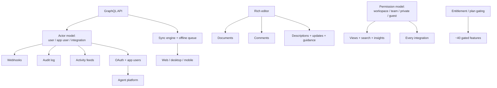
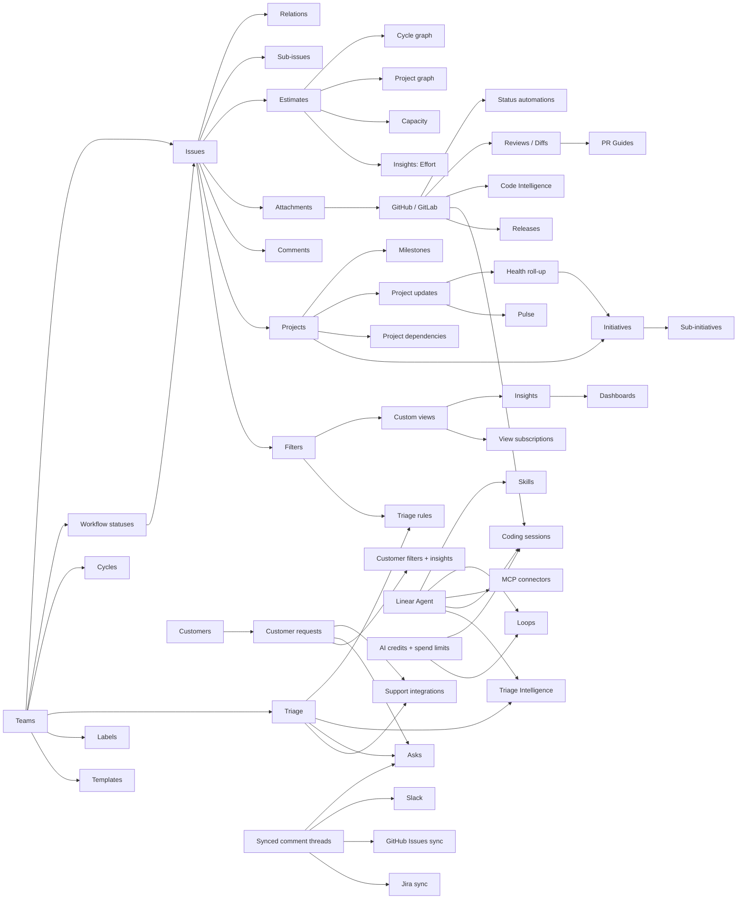

# Interdependency graph

What breaks what. Read this before scoping any single feature — most of Linear's features are cheap on their own and expensive because of what they assume already exists.

## Platform-level dependencies

## Feature-level dependency map

## Reverse index — "if I build X, what must already exist?"

| Feature | Hard prerequisites |
|---|---|
| Cycle graph | Estimates semantics, cycle rollover, snapshot storage |
| Project graph | Estimates, project start date, Started-category status, velocity history |
| Insights | Filter engine, status **categories** (cross-team), estimates, archived-inclusion toggle |
| Dashboards | Insights, private-team exclusion rules, personal-scope objects |
| Triage rules | Triage, the full filter grammar, ordered rule evaluation, cross-team re-entry |
| Triage Intelligence | Triage, embeddings/semantic index over the whole workspace, per-property automation modes, guidance hierarchy |
| SLAs | Priority, filter grammar, business-day calendar, notification engine, due-date exclusivity |
| Asks (Slack) | Triage, form templates, Slack app, synced threads, non-Linear-user identity handling |
| Asks (Email) | Email infrastructure, DMARC/DKIM/SPF handling, forwarding verification, synced threads |
| Asks (Web) | SAML (a *second*, separate SAML app), custom domains, DNS verification, email replies |
| Coding sessions | GitHub code access, sandbox infra, model routing, AI credits, PR drafting, artifact capture |
| Code Intelligence | GitHub code access, per-user repo permission mapping, code index |
| Loops | Agent core, credits + spend limits, permission matrix, versioning, run history, MCP connectors |
| Reviews/Diffs | GitHub code access, per-user GitHub tokens, IP allow-list handling, diff rendering, review submission |
| Releases | Issue-identifier scanning, CI ingest API, pipeline keys, status automation hooks |
| Customer requests | Customers with domain uniqueness, attachments, support integrations, exclusion lists |
| Sub-teams | Teams, inheritance engine, conflict-resolution wizard, cycle merge logic |
| Private teams | Permission model touching every view, search, integration, and export path |
| Guests | Permission model + integration leakage mitigations |
| SCIM | SAML, team↔group mapping, role groups, billing-on-first-login |
| Agent platform | OAuth `actor=app`, delegate field, agent sessions, webhook categories |
| MCP server | OAuth 2.1 + dynamic client registration, read-only scope enforcement |

## Cross-cutting concerns that touch nearly everything

| Concern | Touches |
|---|---|
| **Plan gating** | ~40 features, plus role definitions and integration availability |
| **Private teams / guests** | Views, search, insights, dashboards, exports, unfurls, linkbacks, every integration, webhooks, API keys |
| **Actor attribution** | Activity feeds, webhooks, audit log, insights, filters, notification suppression ("don't notify me about my own actions") |
| **Status categories** | Views, ordering, insights, automations, imports, sync mappings, auto-close/archive |
| **Estimates on/off** | Graphs, capacity, insights, progress percentages, milestone completion |
| **Identifier stability** | Team moves, redirects, search, git magic words, autolinks, release scanning, imports |
| **Archival rules** | Issues, cycles, projects, documents, initiatives, graph integrity, team issue limits |
| **Synced threads** | Slack, Asks ×3, GitHub Issues sync, Jira sync, loop permissions |
| **Notification suppression** | View subscriptions, project notifications, Inbox — "never notify for your own actions" is a rule repeated across features |
| **AI credits** | Coding sessions, loops, billing, spend limits, admin UX, failure modes when the balance is zero |

## Ordering constraints that are not obvious

1. **Attachments before every integration.** Every integration's link is an attachment; the URL-idempotency rule is what lets integrations be stateless.
2. **Synced threads before Asks and before GitHub/Jira sync.** All three are the same primitive.
3. **Filter grammar before triage rules, SLAs, view subscriptions, insights, and loops.** They all reuse it as their condition language.
4. **Status categories before importers.** Import mapping works on category-then-name matching.
5. **Credits before coding sessions and loops.** Otherwise there's no way to stop a runaway.
6. **Templates before Asks and before support integrations.** Both are template-driven.
7. **Triage before support integrations.** Their whole value is routing into triage.
8. **Permission model before search and insights**, not after — retrofitting private-team filtering into a search index is painful.
