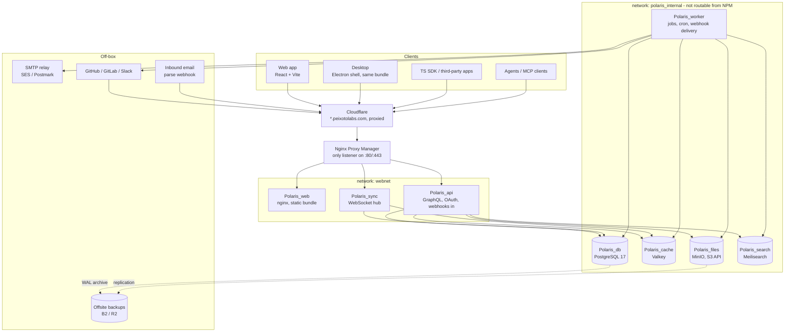

# Architecture overview

## Decisions taken

| Area | Choice |
|---|---|
| Backend | **Go** — GraphQL via `gqlgen`, WebSocket sync hub in the same binary set |
| Frontend | **TypeScript + React + Vite**, one build shared by web and desktop |
| Desktop | **Electron** for Windows + macOS (one Chromium everywhere) |
| Sync | **Custom delta sync over WebSocket**, server-authoritative, local-first client store |
| Hosting | **The existing VPS**, Docker Compose, following the house standard in `/root/SERVER_INFRA.md` |
| API parity | One GraphQL API serves web, desktop, the public SDK, and every integration — no private backdoor API |

The last row is the load-bearing constraint. Everything else can be swapped later; that one cannot.

> **Two deployment modes.** The repository is public and AGPL-licensed, so the default
> `docker-compose.yml` must work for a stranger on a bare VPS. Everything below describes
> **our cloud deployment** on the existing fleet, applied as an override. See
> `10-self-host-and-cloud.md` for the public default and how the two differ.

## Fleet conventions this inherits

Polaris is a tenant on a box that already runs ~20 first-party sites. It follows the same rules as `MealMindApp`, `Almanac`, `Montra`, and `Avaliar` — deviations are marked **[differs]** with a reason.

- **No `ports:` anywhere.** Nginx Proxy Manager is the only thing bound to `:80/:443`; it reaches containers by name over the shared external `webnet` network.
- **`<Prefix>_<role>` container names** — `Polaris_api`, `Polaris_sync`, `Polaris_worker`, `Polaris_db`, …
- **Secrets in a root-owned 600 file outside the repo** — `/root/.config/polaris/polaris.env`, injected via `env_file:`, never committed, never baked into an image.
- **Every service gets** `mem_limit`, a `healthcheck`, capped `logging` (json-file, 10m × 3), `restart: unless-stopped`, a `org.opencontainers.image.revision` label, a non-root uid/gid 10001, and pinned base-image patch tags.
- **Datastores are not on `webnet`.** A second internal network carries app ↔ database. Nothing NPM can route to should be able to reach Postgres.
- **`./app.sh start|stop|restart|status|logs [service]`** for local bring-up and emergencies.
- **Deploy is publishing a release**: `git tag vX.Y.Z && git push --tags`, picked up by `admin-deploy.timer` with health-check and auto-rollback. Plus an entry in `/root/AdminPanel/registry.yml`.
- **`REQUIRE_CLOUDFLARE=true`** on anything public, with `/healthz` checked *before* that gate so container healthchecks still work.
- **Nightly backups** to `/srv/polaris/backups`, 30-day retention. **[differs]** plus offsite, because this database is the product.

## System diagram



`Polaris_worker` sits on the internal network only — it makes outbound calls but nothing routes to it.

## Services

| Container | Role | Port | Public host | mem_limit (start) |
|---|---|---|---|---|
| `Polaris_web` | nginx serving the built SPA + immutable assets | 8080 | `polaris.peixotolabs.com` | 64m |
| `Polaris_api` | GraphQL, OAuth 2.0, inbound webhooks, file signing, bootstrap snapshot | 8088 | same host, custom locations | 512m |
| `Polaris_sync` | WebSocket hub, delta fan-out, presence | 8089 | same host, `/sync` | 512m |
| `Polaris_worker` | webhook delivery, cron, integrations, indexing, email, exports, imports | — | none | 512m |
| `Polaris_db` | PostgreSQL 17 | 5432 | none | 2g |
| `Polaris_cache` | Valkey: pub/sub, job queue, rate limits, presence | 6379 | none | 256m |
| `Polaris_files` | MinIO (S3 API, cloud only — self-host defaults to a filesystem driver) for attachments, avatars, exports | 9000 | none | 512m |
| `Polaris_search` | Meilisearch index | 7700 | none | 512m |

**Total starting budget ≈ 5 GB.** Check the box has it before starting — see `09-scaling-and-cost.md` for the lean profile (Postgres FTS instead of Meilisearch, a bind-mounted volume instead of MinIO) that fits in ~3 GB.

## Routing: one origin, NPM custom locations

Everything lives under **one hostname** so the browser sees one origin — no CORS for first-party clients, cookies work everywhere, and the desktop app points at a single base URL.

NPM Proxy Host `polaris.peixotolabs.com` → `http://Polaris_web:8080`, plus **Custom Locations**:

| Location | Forward to | Notes |
|---|---|---|
| `/graphql` | `Polaris_api:8088` | POST; introspection only in dev |
| `/sync` | `Polaris_sync:8089` | **Websockets Support toggle ON** in NPM, and raise `proxy_read_timeout` to 3600s in the location's Advanced tab, or idle sockets die every 60s |
| `/sync/bootstrap` | `Polaris_api:8088` | Streaming snapshot, long response |
| `/oauth/` | `Polaris_api:8088` | authorize, token, revoke |
| `/webhooks/` | `Polaris_api:8088` | Inbound from GitHub/GitLab/Slack/Sentry/CI/email |
| `/files/` | `Polaris_api:8088` | Auth check → 302 to a presigned MinIO URL |
| `/` (default) | `Polaris_web:8080` | SPA fallback |

Cert: reuse the existing `*.peixotolabs.com` wildcard (NPM cert id 1). DNS: covered by the Cloudflare wildcard, no new record. `admin` stays reserved by the fleet.

**Cloudflare caveat for `/sync`:** the orange-cloud proxy supports WebSockets, but idle connections are cut at ~100s. The client must send a ping every ~30s regardless; that's in the protocol anyway (`03-sync-engine.md`).

## Request paths

**Cold start**
```
boot → GET /sync/bootstrap?workspace=W
     → api streams a permission-scoped snapshot (NDJSON + gzip)
     → client writes IndexedDB, records version V
     → open WS /sync, send {resume: V}
```

**Warm read** — served entirely from the local store. **No network on the hot path.** Filters, grouping, ordering, peek all run against IndexedDB indexes. This is the whole point.

**Write**
```
action → optimistic apply + render
       → op appended to a durable outbox (IndexedDB)
       → POST /graphql with client op id
       → server: validate → apply in one tx → append change_log
         → bump workspace version → publish to Valkey
       → sync hub fans out the delta to every subscriber of W
       → originating client confirms or rebases
```

**Integration inbound**
```
GitHub → POST /webhooks/github → verify HMAC → 200 immediately
       → enqueue (valkey) → worker parses magic words, resolves the issue
       → calls the SAME domain service GraphQL calls
       → change_log → Valkey → clients update live
```

**Integration outbound**
```
change_log → worker matches subscriptions → sign HMAC-SHA256 → POST (5s timeout)
           → retry 1m / 1h / 6h → disable after persistent failure
           → one delivery-log row per attempt
```

## Why these choices hold

**Go for api + sync.** The sync hub is the connection- and memory-heavy part; goroutine-per-connection with a shared broadcast hub is Go's canonical strength. ~10k idle WebSockets cost tens of MB of heap rather than hundreds. `gqlgen` gives typed resolvers and ships query-complexity limiting, which the API spec (`03-platform/01-graphql-api.md`) requires anyway.

**One TS bundle for web + Electron.** The desktop app is a shell: identical React build plus a preload bridge for notifications, badge, tray, deep links, protocol handler, and the terminal/coding-tool handoff. No second frontend.

**Custom sync.** Private teams, guests, sub-teams, and per-issue sharing mean every client's dataset is a *different* filtered subset of the workspace. Off-the-shelf replication handles whole-table or simple-predicate cases well and permission-scoped partial replication badly. Owning the protocol keeps the visibility predicate in the same Go code as GraphQL authorisation — one implementation, not two.

**This VPS.** The scope is ~150 product features. Infrastructure elaborateness contributes nothing to them, and the box already has an ingress, a deploy pipeline, monitoring, and a backup habit. Reuse them.

## Deliberately off this box

| Thing | Why | Where |
|---|---|---|
| **Outbound email** | VPS IPs have poor sender reputation, and Asks requires DKIM/SPF/DMARC alignment on a customer's own domain | SMTP relay: SES / Postmark / Resend |
| **Inbound email parsing** | Running an MTA next to the product database is an ops and security liability | SES inbound → S3 → webhook, or Postmark inbound webhook → `/webhooks/email` |
| **Coding-session sandboxes** | Executing model-authored code beside the database is unacceptable | Disposable runner hosts, gVisor/Firecracker, no network path back. Phase 6 |
| **Offsite backups** | A backup on the same disk is not a backup | Backblaze B2 / Cloudflare R2 |
| **Status page** | Must survive the box being down | External provider |

## Non-negotiables baked into the design

1. **Every mutation flows through one domain layer** — GraphQL, webhooks, importers, agents, and cron all call it.
2. **Every mutation emits change-log rows in the same transaction.** Sync, outbound webhooks, activity feeds, and the audit log all derive from that one stream.
3. **Every mutation carries an actor** (`user | app_user | integration | system`) because the product surfaces actors everywhere.
4. **Permission filtering is one function**, shared by resolvers, sync deltas, search, and exports. Two implementations means one leaks.
5. **Nothing on the hot read path touches the network.**
