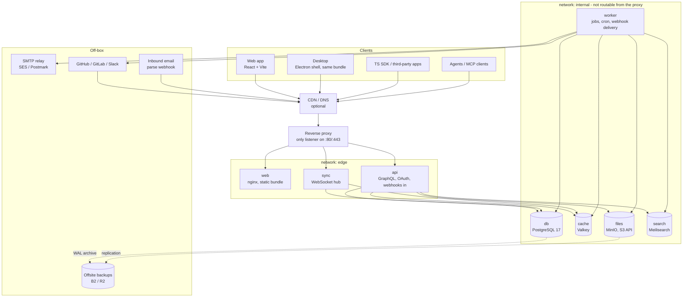

# Architecture overview

## Decisions taken

| Area | Choice |
|---|---|
| Backend | **Go** — GraphQL via `gqlgen`, WebSocket sync hub in the same binary set |
| Frontend | **TypeScript + React + Vite**, one build shared by web and desktop |
| Desktop | **Electron** for Windows + macOS (one Chromium everywhere) |
| Sync | **Custom delta sync over WebSocket**, server-authoritative, local-first client store |
| Hosting | **Docker Compose.** The repository ships a self-contained stack; running behind a reverse proxy somebody already operates is an override |
| API parity | One GraphQL API serves web, desktop, the public SDK, and every integration — no private backdoor API |

The last row is the load-bearing constraint. Everything else can be swapped later; that one cannot.

> **Two deployment shapes.** The default `docker-compose.yml` in this repository is
> self-contained — its own Caddy, published ports — because it has to work for a stranger who
> has just cloned it. Running behind a reverse proxy that already owns `:80` and `:443` is an
> override, not a different product. See `10-self-host-and-cloud.md` for how the two differ
> and `05-deployment.md` for the rules an override has to keep.

## Operational conventions

These are stated because getting one wrong produces a failure that looks like something
else, not because they are unusual.

- **Publish ports, or join a proxy network — never both.** Behind an existing proxy Polaris
  publishes nothing and is reached by container name on a shared network. Publishing anyway
  puts the app on a high port without the proxy's TLS, rate limits or access log, and
  nothing says so.
- **Datastores are not on the ingress network.** A second, internal network carries
  app ↔ database. Nothing the proxy can route to should be able to reach Postgres.
- **Secrets come from a root-owned `600` file outside the repository**, injected via
  `env_file:` — never committed, never baked into an image, never on a command line where
  `ps` can read it.
- **Every service gets** `mem_limit`, a `healthcheck`, capped `logging` (json-file, 10m × 3),
  `restart: unless-stopped`, an `org.opencontainers.image.revision` label, a non-root
  uid/gid 10001, and pinned base-image patch tags. An unbounded container takes the machine
  down with it rather than dying alone.
- **Deploy is publishing a release**: `git tag vX.Y.Z && git push --tags`. Migrations run to
  completion under an advisory lock before any new code starts, and a failed one aborts the
  deploy. See `05-deployment.md`.
- **Backups are nightly, with offsite copies**, because this database is the product.

## System diagram



The worker sits on the internal network only — it makes outbound calls and nothing routes to it.

## Services

| Service | Role | Port | Reachable from outside | mem_limit (start) |
|---|---|---|---|---|
| `web` | nginx serving the built SPA + immutable assets | 8080 | the site root | 64m |
| `api` | GraphQL, OAuth 2.0, inbound webhooks, file signing, bootstrap snapshot | 8088 | same host, specific paths | 512m |
| `sync` | WebSocket hub, delta fan-out, presence | 8089 | same host, `/sync` | 512m |
| `worker` | webhook delivery, cron, integrations, indexing, email, exports, imports | — | no | 512m |
| `db` | PostgreSQL 17 | 5432 | no | 2g |
| `cache` | Valkey: pub/sub, job queue, rate limits, presence | 6379 | no | 256m |
| `files` | MinIO (S3 API; the default is a filesystem driver) for attachments, avatars, exports | 9000 | no | 512m |
| `search` | Meilisearch index | 7700 | no | 512m |

**Total starting budget ≈ 5 GB.** Check the box has it before starting — see `09-scaling-and-cost.md` for the lean profile (Postgres FTS instead of Meilisearch, a bind-mounted volume instead of MinIO) that fits in ~3 GB.

## Routing: one origin

Everything lives under **one hostname** so the browser sees one origin — no CORS for
first-party clients, cookies work everywhere, and the desktop app points at a single base
URL. The repository's Caddyfile is the reference implementation of the table below;
`scripts/lint-routes.sh` checks it against the paths the servers actually register, because
a proxy that sends one path to the wrong process produces a healthy-looking install with an
empty workspace.

| Location | Forward to | Notes |
|---|---|---|
| `/graphql` | `api:8088` | POST; introspection only in development |
| `/sync` | `sync:8089` | Needs WebSocket upgrade and a read timeout of an hour, or idle sockets die every 60s |
| `/sync/bootstrap` | `api:8088` | Streaming snapshot, long response. **Must be matched before `/sync`** |
| `/oauth/token`, `/oauth/revoke` | `api:8088` | Token exchange and revocation |
| `/mcp`, `/mcp/readonly` | `api:8088` | Streamable HTTP MCP. Raise `proxy_read_timeout`. |
| `/asks/` | `api:8088` | Public Asks intake. Token in the path is the credential. |
| `/.well-known/oauth-*` | `api:8088` | MCP OAuth discovery |
| `/oauth/authorize` | `web:8080` | Consent screen (SPA) |
| `/webhooks/` | `api:8088` | Inbound from GitHub/GitLab/Slack/Sentry/CI/email |
| `/files/` | `api:8088` | Auth check → 302 to a presigned object-store URL |
| `/` (default) | `web:8080` | SPA fallback |

**If a CDN sits in front**, check its idle-connection limit for `/sync` — most cut a quiet
WebSocket at around 100 seconds. The client pings every 30 seconds regardless, which is in
the protocol for this reason (`03-sync-engine.md`).

## Request paths

**Cold start**
```
boot → GET /sync/bootstrap?workspace=W
     → api streams a permission-scoped snapshot (NDJSON + gzip)
     → client writes IndexedDB, records version V
     → open WS /sync, send {resume: V}
```

**Warm read** — served entirely from the local store. **No network on the hot path.** Filters, grouping, ordering, peek all run against IndexedDB indexes. This is the whole point.

**Write**
```
action → optimistic apply + render
       → op appended to a durable outbox (IndexedDB)
       → POST /graphql with client op id
       → server: validate → apply in one tx → append change_log
         → bump workspace version → publish to Valkey
       → sync hub fans out the delta to every subscriber of W
       → originating client confirms or rebases
```

**Integration inbound**
```
GitHub → POST /webhooks/github → verify HMAC → 200 immediately
       → enqueue (valkey) → worker parses magic words, resolves the issue
       → calls the SAME domain service GraphQL calls
       → change_log → Valkey → clients update live
```

**Integration outbound**
```
change_log → worker matches subscriptions → sign HMAC-SHA256 → POST (5s timeout)
           → retry 1m / 1h / 6h → disable after persistent failure
           → one delivery-log row per attempt
```

## Why these choices hold

**Go for api + sync.** The sync hub is the connection- and memory-heavy part; goroutine-per-connection with a shared broadcast hub is Go's canonical strength. ~10k idle WebSockets cost tens of MB of heap rather than hundreds. `gqlgen` gives typed resolvers and ships query-complexity limiting, which the API spec (`03-platform/01-graphql-api.md`) requires anyway.

**One TS bundle for web + Electron.** The desktop app is a shell: identical React build plus a preload bridge for notifications, badge, tray, deep links, protocol handler, and the terminal/coding-tool handoff. No second frontend.

**Custom sync.** Private teams, guests, sub-teams, and per-issue sharing mean every client's dataset is a *different* filtered subset of the workspace. Off-the-shelf replication handles whole-table or simple-predicate cases well and permission-scoped partial replication badly. Owning the protocol keeps the visibility predicate in the same Go code as GraphQL authorisation — one implementation, not two.

**This VPS.** The scope is ~150 product features. Infrastructure elaborateness contributes nothing to them, and the box already has an ingress, a deploy pipeline, monitoring, and a backup habit. Reuse them.

## Deliberately off this box

| Thing | Why | Where |
|---|---|---|
| **Outbound email** | VPS IPs have poor sender reputation, and Asks requires DKIM/SPF/DMARC alignment on a customer's own domain | SMTP relay: SES / Postmark / Resend |
| **Inbound email parsing** | Running an MTA next to the product database is an ops and security liability | SES inbound → S3 → webhook, or Postmark inbound webhook → `/webhooks/email` |
| **Coding-session sandboxes** | Executing model-authored code beside the database is unacceptable | Disposable runner hosts, gVisor/Firecracker, no network path back. Phase 6 |
| **Offsite backups** | A backup on the same disk is not a backup | Backblaze B2 / Cloudflare R2 |
| **Status page** | Must survive the box being down | External provider |

## Non-negotiables baked into the design

1. **Every mutation flows through one domain layer** — GraphQL, webhooks, importers, agents, and cron all call it.
2. **Every mutation emits change-log rows in the same transaction.** Sync, outbound webhooks, activity feeds, and the audit log all derive from that one stream.
3. **Every mutation carries an actor** (`user | app_user | integration | system`) because the product surfaces actors everywhere.
4. **Permission filtering is one function**, shared by resolvers, sync deltas, search, and exports. Two implementations means one leaks.
5. **Nothing on the hot read path touches the network.**
