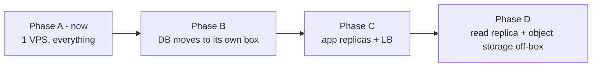

# Scaling path and cost

## What one VPS actually holds

Assumptions: a workspace is ~30 active users; a user keeps 1–2 clients connected; writes cluster in working hours.

| Resource | Cost per unit | Binding constraint |
|---|---|---|
| WebSocket connection | ~30 KB heap + ~20 KB kernel buffers | RAM, then file descriptors (`ulimit -n 65535`) |
| Active user | ~2–5 writes/min peak | Postgres write throughput (trivial), fan-out CPU |
| GraphQL query | 2–40 ms typical | Postgres CPU |
| Bootstrap | 3–25 MB gzipped, 2–20 s | Disk read + network egress; the real limit |
| Workspace | 2–3 GB Postgres at 100k issues | Disk |

**Practical ceiling for the full profile on a 4 vCPU / 8 GB box: roughly 1,500–2,500 concurrent connections and 30–60 workspaces**, assuming Polaris's ~5 GB budget is actually free after the other twenty tenants.

The first thing to break is **not** what people expect. It is bootstrap bandwidth and Postgres read CPU during a resync storm — not steady-state writes.

## Lean profile (start here if RAM is tight)

| Drop | Replace with | Saves | Costs you |
|---|---|---|---|
| Meilisearch | Postgres FTS (GIN + trigram) | ~512 MB + a service | Typo tolerance, ranking quality |
| MinIO | Bind-mounted volume behind the same `internal/files` interface | ~512 MB + a service | Presigned uploads (proxy through Go instead), later migration work |
| pgbouncer | Direct pool, `max_conns` tuned low | ~128 MB | Headroom when replicas multiply |

That is ~3 GB instead of ~5 GB. Both swaps are one Go package each, chosen behind an interface from day one precisely so this decision stays reversible.

## Split points, in the order they'll be needed

### Phase B — separate the database (first real split)
**Trigger:** Postgres consistently >50% of a core, or the noisy-neighbour risk from twenty other tenants becomes unacceptable.
**Move:** `db` + `pgbouncer` to a dedicated VPS with private networking.
**Work:** change `DATABASE_URL`, put both boxes on a private network, enable TLS between them. Everything else is unchanged — this is why `workspace_id` is on every table and why nothing assumes a local socket.

### Phase C — replicate the app tier
**Trigger:** api or sync CPU-bound at peak, or you want genuine zero-downtime deploys.
**Move:** 2–3 replicas of api/sync/worker behind NPM upstreams (or swap NPM for Caddy/HAProxy if you outgrow its load-balancing).
**Prerequisite already built:** Valkey fan-out means sync replicas are interchangeable; sessions hold no local state that matters; jobs are queue-driven.
**Watch:** sticky sessions are *not* required for correctness (a reconnect to another replica just resumes from `version`), but they reduce bootstrap churn.

### Phase D — read replica and off-box object storage
**Trigger:** bootstraps and Insights compete with interactive queries.
**Move:** a streaming replica serving bootstrap snapshots, Insights, and exports; attachments to Cloudflare R2 (same S3 API, no egress fees) with a CDN in front.
**Watch:** replica lag versus the sync version — always read the version from the **primary**, or a client bootstraps at a version the primary hasn't reached and misses deltas. Cheapest fix: pin version reads to the primary, take snapshot rows from the replica, and confirm the replica has caught up to that version before streaming.

> **No Phase E.** Residency is EU-only for the cloud, and self-hosters choose their own
> hardware — so the regional split that a US/EU promise would have forced is off the table.
> If that ever changes, it is a project, not a config change; decide before selling it.

## What never scales by adding replicas

| Problem | Real fix |
|---|---|
| Bootstrap size on huge workspaces | Tiered bootstrap (recent + referenced), then lazy backfill |
| Insights on millions of issues | Pre-aggregated read model / columnar store, refreshed incrementally |
| Search relevance | Meilisearch (or OpenSearch at real scale) |
| Rich-text collaboration at scale | A dedicated Yjs service with its own persistence |
| Coding sessions | Separate disposable runners — never the app tier |
| A single hot workspace | Per-workspace version locking eventually caps write rate; move to LSN-based ordering |

## Cost

### Now (single VPS, marginal cost on an existing box)

Freemium note: every free workspace is your cost. The quota and abuse controls in `10-self-host-and-cloud.md` are what keep this table honest once signup opens.

| Item | €/month |
|---|---|
| VPS share (Polaris's slice of an existing box) | 0–20 |
| Offsite backups (B2/R2, ~50 GB + egress) | 1–5 |
| SMTP relay (SES ~€0.09/1k, or Postmark from €13) | 1–15 |
| Domain / DNS (Cloudflare, existing wildcard) | 0 |
| Error tracking (Sentry free tier) | 0 |
| **Running total** | **~5–40** |

### One-off and annual

| Item | Cost |
|---|---|
| Apple Developer Program | €99/yr |
| Windows code-signing cert (OV, HSM-backed) | €200–400/yr |
| Windows EV cert (better SmartScreen) | €300–600/yr |
| GitHub Actions (macOS runners for signing) | free tier usually enough; macOS minutes bill 10× |

### If you outgrow the box

| Step | €/month |
|---|---|
| Dedicated DB VPS (4 vCPU / 16 GB / NVMe, Hetzner-class) | 25–50 |
| App VPS ×2 | 20–40 |
| R2/B2 object storage (200 GB + requests) | 3–10 |
| Managed Postgres instead of self-hosted (if ops time costs more than money) | 50–200 |
| **Realistic "we have paying customers" total** | **~60–150** |

The dominant cost is not infrastructure. It is the ~12 XL engineering items in `04-scope/01-feature-inventory.md`. Infrastructure here is deliberately cheap so the money goes into the product.

## Performance budget (treat as acceptance criteria)

From the product's own positioning — speed *is* the feature:

| Interaction | Budget |
|---|---|
| Keystroke → UI response | < 16 ms (one frame) |
| Filter/group/sort a 5,000-issue view | < 50 ms, from the local store |
| Issue open (peek or full) | < 50 ms, no network |
| Mutation → optimistic render | < 16 ms |
| Mutation → server ack | < 200 ms p95 |
| Change committed → other clients render | < 500 ms p99 |
| Cold bootstrap, 10k-issue workspace | < 5 s |
| App cold start (desktop, bundled) | < 1.5 s to interactive |
| GraphQL p95 (simple query) | < 100 ms |
| Search p95 | < 300 ms |

Wire these into CI as regression tests with seeded data. A product whose entire differentiator is speed cannot discover a 3× regression from a user report.

## Decisions still open

1. **Meilisearch from day one, or Postgres FTS first?** Recommendation: FTS first, and only add Meilisearch when search quality complaints appear.
2. **MinIO or a plain volume to start?** Recommendation: MinIO, because presigned direct uploads are genuinely better and the migration to R2 later becomes free.
3. **Where do bootstrap snapshots come from once there's a replica?** Decide with Phase D; it changes the version-consistency handling.
4. **Do you want per-workspace database isolation** (schema-per-workspace) for enterprise customers? It makes export/delete/residency trivial and connection management painful. Almost certainly no, but worth an explicit decision.
5. **Free-tier storage quota enforcement** — launch-blocking before open signup (see `10-self-host-and-cloud.md`).
